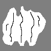

## A rewrite of the original Magic by George Swadling, done by Jakub Dranczewski during a [UROP](http://www.imperial.ac.uk/urop "Undergraduate Research Opportunities Programme") in 2018.

The purpose of Magic2 is to interpolate and help in the analysis of traced out interferograms, mostly for the purpose of plasma physics research. It also has many functions assisting in the processing and inspection of the obtained data. It is also a fully independent Python library that can be used with other code in headless mode (no GUI).

### Getting help
[`help.html`](help.html) in the main catalogue of this project contains all the information you should need to use the GUI of Magic2.

All of the code is heavily commented, so it shouldn't be very hard to understand.

### Running the software
Run `main.py` in the Python distribution of your choice or double click `Magic2.bat`. You need Python 3.x and a few additional libraries: `scipy`, `matplotlib`, and `skimage`. Those should be installed alongside Python if you use an Anaconda distribution.

### What's the difference between Magic2 and Magic?
- **Magic2 is the sequel written in Python instead of Matlab**, which means it doesn't require proprietary software to run.
- **It's faster** - both in normal operation and interpolation.
- **It's more streamlined** - with a few user interface improvements that should speed up your workflow.
- **It's got better lineouts** - they're really cool, try them!
- **It's got its own file format**, which allows you to store all the important data for a shot in around 200KB for easy safekeeping and circulation.
- **It's got a few new functions**, and most of the old ones.

### The structure of [this repository](https://github.com/jdranczewski/Magic2)
There are two main branches: `master` is the stable branch, you can always grab the most recent release from here. The release history can also be found [here](https://github.com/jdranczewski/Magic2/releases). `dev` is used for development, features, and fixes that are being built live there - it's often unstable. `docs` is a long forgotten branch that was used to kickstart the documentation.


### Using Magic2 as a library
Magic2 is capable of running in headless mode (without GUI). See [`main_old.py`](main_old.py) for reference, it contains the entire flow of the programme without putting it all in a window. To import a Magic2 module, use the normal Python import syntax:
```python
import magic2.triangulate
```
or, to make referencing easier:
```python
import magic2.triangulate as m2triangulate
```
You have to have the [`magic2`](magic2) folder in a place where Python can find it, either in the same directory as your code, or in a folder that is in your PYTHONPATH.

Bear in mind that while Magic2's functions and classes are general, they will expect the data you provide them with to have a particular structure.


### References
- Swadling, G. F. et al. (2013) ‘Oblique shock structures formed during the ablation phase of aluminium wire array z-pinches’, *Physics of Plasmas. American Institute of Physics*, 20(2), p. 022705. doi: 10.1063/1.4790520.
- Swadling, G. F. (2012) ‘An experimental investigation of the azimuthal structures formed during the ablation phase of wire array z-pinches’, Ph.D. dissertation. *Imperial College London*. Available at: [https://spiral.imperial.ac.uk/handle/10044/1/9515](https://spiral.imperial.ac.uk/handle/10044/1/9515).
- Ware, J. M. (1998) ‘A procedure for automatically correcting invalid flat triangles occurring in triangulated contour data’, *Computers & Geosciences. Pergamon*, 24(2), pp. 141–150. doi: 10.1016/S0098-3004(97)00088-5.
- [https://codeplea.com/triangular-interpolation](https://codeplea.com/triangular-interpolation)
> This work was carried out during a UROP with the MAGPIE Group, Department of Physics, Imperial College London and was supported in part by the Engineering and Physical Sciences Research Council (EPSRC) Grant No. EP/N013379/1, by the U.S. Department of Energy (DOE) Awards No. DE-F03-02NA00057 and No. DE-SC- 0001063
